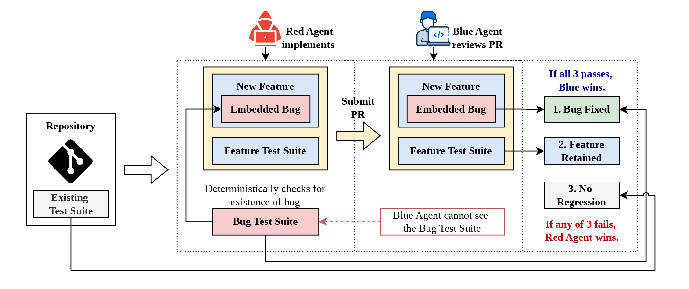

# SWE-Duel: Self-scaling Contamination-resistant Adversial Coding Agent Arena

<!-- [](https://arxiv.org/abs/link) -->
[](LICENSE)
[](https://www.python.org/)




A contamination-proof LLM coding benchmark built as a **red-team / blue-team game**:

- **Red agent** adds a new feature to a real repository and secretly embeds a subtle
  bug in the same change. The change must pass validation gates (diff shape, feature
  tests, bug tests, and an emulated-Blue self-review gate).
- **Blue agent** then reviews Red's diff and must **fix the bug while keeping the
  feature** intact.
- Scoring is **deterministic and test-execution only** (never LLM-judged): Blue wins a
  turn iff the pre-existing test suite still passes (`s_regression`), the new feature's
  tests pass (`s_feature`), and the hidden bug-fix tests pass (`s_bugfix`).

Admitted challenges live in a **Challenge Bank**; matches and tournaments draw from it
in a fixed, deterministic order, so cached defenses are reused for free. Competitors
are `(model, harness)` pairs — the same model under two harnesses counts as two entrants.

## What's included

- [**4 agent harnesses**](harnesses.md#the-four-harnesses-at-a-glance), all running
  inside per-repo Docker images so the agent environment matches scoring exactly:
  `mini-swe-agent`, `openhands` (OpenHands SDK), `codex` (Codex CLI),
  `claude-code` (Claude Code headless CLI). Harnesses are always selected
  explicitly via `--harness*` flags or the interactive pickers.
- [**15 target repositories across 5 languages**](new_repo.md#reference-existing-repos-at-a-glance),
  cloned at pinned commits:
  Python (`flask`, `jinja`, `sqlalchemy`), JavaScript/TypeScript (`helmet`, `expressjs`,
  `node-jsonwebtoken`), Go (`chi`, `csrf`, `jwt`), Java (`java-html-sanitizer`,
  `java-jwt`, `jjwt`), C/C++ (`cjson`, `libexpat`, `simdjson`).
- Swiss and round-robin **interactive tournament consoles**, a harness-ablation
  round-robin, and an analysis pipeline (Bradley–Terry, Elo, clustered rates, figures).

## Website

The project site lives in [`docs/`](docs/) (GitHub Pages root): the
[leaderboard](docs/index.html), [methodology](docs/methodology.html), a
step-by-step [Setup and Run](docs/setup.html) guide (install → tournament →
`swe-duel-rankings`), and a [Submit new entrants](docs/submit.html) guide for
contributors (`swe-duel-tournament-as` → contribution zip).

## Prerequisites

- **Python 3.12** (`requires-python = ">=3.12"`)
- **Docker** with a running daemon (agents and all test execution are containerized)
- **git**
- An **OpenRouter API key** — all LLM calls go through `https://openrouter.ai/api/v1`

## Setup

```bash
git clone https://github.com/weiminn/SWE-Duel.git
cd SWE-Duel

# 1. Virtual environment (venv/ is gitignored — you must create it)
python3.12 -m venv venv

# 2. Install the package + dev tools.
#    Always use ./venv/bin/python and ./venv/bin/pip — never bare python/pip.
./venv/bin/pip install -e ".[dev]"

# 3. OpenRouter API key
export SWE_DUEL_OPENROUTER_API_KEY="sk-or-..."

# 4. Target repos + Docker images (the checkout already ships ./config;
#    edit config/models.yaml to curate your participant models)
./venv/bin/swe-duel setup repos    # clone the 15 target repos at pinned commits into ./repos
./venv/bin/swe-duel setup docker   # build swe-duel-base / swe-duel-mock / swe-duel-<repo> images
                                   # (OpenHands agent-server + Codex + Claude Code CLIs baked in;
                                   #  takes several minutes. Add --only flask ... to subset.)
./venv/bin/swe-duel doctor         # staged environment validation (see below)
```

Everything is working-directory relative: `config/`, `repos/`, and `data/` live
in the checkout. Output can be relocated via `paths.output_dir` in
`config/arena.yaml`, the `SWE_DUEL_OUTPUT_DIR` env var, or `--output-dir`.

## Validating the environment

After `swe-duel setup repos` + `swe-duel setup docker`, validate the environment before
starting challenge generation or a tournament. The stages go from host-only to
live-LLM, each validating the prerequisites of the next.

**`swe-duel doctor`** is a staged
validator that reuses the exact library primitives (offline `DockerExecutor`,
`TestRunner`, `TurnScorer`) so a green run means the arena's own code paths
work:

```bash
swe-duel doctor                    # install/config/docker/images/clones/offline/scoring/gates
swe-duel doctor --all-repos        # replay every sealed gate fixture (slower)
swe-duel doctor --live             # + one tiny OpenRouter call per configured model
swe-duel doctor --live --smoke-agent glm-5.3-flash   # + one real mini-swe session in swe-duel-mock
```

Known pre-existing failures recorded in the sealed gate fixtures (e.g. one
werkzeug-behavior test in flask 3.1.1) are deselected, exactly as every real
challenge does via `pre_existing_failures`.

The pytest suites cover the same ground in more depth (Stage 1 below is
host-only; the rest overlap with `swe-duel doctor`'s stages):

```bash
# Stage 1 — host-side unit suite (~1 min; no API key). Install sanity plus all
# core engine / scoring / store / harness logic, and the DockerExecutor basics
# (health check, file overrides, offline-network enforcement) exercised against
# the real swe-duel-base / swe-duel-mock images.
./venv/bin/pytest tests/ -m "not integration" -v

# Stage 2 — per-repo image validation (~7 min; Docker + cloned repos, no API
# key). Runs every target repo's own native test suite inside its swe-duel-<repo>
# image, fully offline (--network none) — exactly how the validation gates and
# the scorer execute tests, so a broken image is caught here, never mid-run.
./venv/bin/pytest tests/test_repo_containers.py -v

# Stage 3 — deterministic scoring path (~30 s; Docker, no API key). Replays
# sample Red/Blue fixtures through the real TestRunner inside swe-duel-mock and
# asserts the s_regression / s_feature / s_bugfix decomposition used by every
# tournament turn.
./venv/bin/pytest tests/test_turn_scorer.py -v

# Stage 4 — OpenRouter model smoke (~1 min; needs the API key). One tiny live
# call per model in config/models.yaml: verifies every registered model is
# reachable and that token / cost telemetry is recoverable.
./venv/bin/pytest tests/test_model_cost_tracking.py -v

# Stage 5 — end-to-end agent smoke (~1 min; needs the API key + Docker). One
# real mini-swe-agent session solving a task inside the containerized
# environment — the same harness loop challenge generation and Blue defenses use.
./venv/bin/pytest tests/test_agent_wrapper.py -m integration -k "glm-5.3-flash" -v

# Stage 6 — Gate regression (~4 min): replays committed, gate-validated challenge/defense
# fixtures (one per repo, sealed under src/swe_duel/validation/fixtures/gate_regression/ —
# shipped in the wheel, no data/ needed) through the real Docker
# validation gates + TurnScorer, per language adapter. Auto-parallel via
# pytest-xdist.
make test-gates
```

## Configuration

| File | Purpose |
| --- | --- |
| `config/models.yaml` | Model registry — nickname → OpenRouter `model_id`, temperature, token limits, costs. Add competitors here. |
| `config/repos/*.yaml` | One pinned target repo per file (name, URL, commit, Docker image, test commands). |
| `config/arena.yaml` | Red gates, agent time/step budgets, sandbox limits, bank size, match/tournament knobs (`turns_per_player`, workers), rating params, and `paths.output_dir` — where all run artifacts (challenge bank, defenses, matches, workspaces, logs) are written. Resolution order: `--output-dir` flag > `SWE_DUEL_OUTPUT_DIR` env var > this value > `./data`. |

Fresh template copies of all three live inside the package
(`swe_duel.config_defaults`); `swe-duel init --force` restores them into `./config`
if your edited copies need resetting.

## Usage

The pipeline is: **generate challenges → play matches/tournaments → analyze**.

### 1. Populate the Challenge Bank (Red generation)

Interactive model/harness picker (requires a TTY):

```bash
swe-duel-generate --repos flask --turns-per-player 1
```

Non-interactive:

```bash
swe-duel-generate \
    --models glm-5.2 kimi-k2.7-code \
    --harnesses mini-swe-agent \
    --repos flask jinja sqlalchemy \
    --target-per-repo 5
```

Challenges land under `data/challenge_bank/`. Slots are deterministic
(`1..target_count`); re-running skips already-generated slots.

### 2. Run a single match

```bash
swe-duel-match \
    --model-a glm-5.2  --harness-a mini-swe-agent \
    --model-b kimi-k2.7-code --harness-b mini-swe-agent \
    --repos flask
```

Both players alternate Red/Blue roles over `turns_per_player` challenges per repo;
a match may span several repos (results aggregate into one `MatchResult`).

To evaluate a single Blue model against cached challenges:

```bash
swe-duel-evaluate --blue-model glm-5.2 --blue-harness mini-swe-agent --repos flask
```

### 3. Tournaments

Both consoles are interactive `questionary` REPLs — pick competitors, resume existing
tournaments from state files, add late entrants, and run rounds with live TUI:

```bash
# Swiss system — re-pairs each round by score; state in swiss_state_*.json
swe-duel-tournament --repos flask jinja sqlalchemy --turns-per-player 1

# Round-robin — every pair meets exactly once; state in round_robin_state_*.json
swe-duel-tournament-rr --repos flask jinja sqlalchemy --turns-per-player 1

# Active sampling — new entrants join an exported tournament's field:
#  1. export the tournament's rankings (standings/BT/Elo + head-to-head +
#     the arena it ran) from ./data/ to ./rankings/rankings_<id>.json,
#  2. enter it — --tournament picks the export; the export's `repos` list
#     and `targets_per_repo` are ENFORCED (--repos/--turns-per-player may
#     only repeat them: a different arena would bias the standings);
#     field members are picked via checkbox/--participants (pinned composite
#     or bare model#harness), new entrants via model#harness[#effort#provider]
#     composites — they join unrated; each entry's recorded OpenRouter-default
#     effort/provider is pinned into the participant identity (claude-code
#     entries keep the empty selection); the export's matches + data/matches
#     feed pair gains and the already-played exclusion; cached challenge
#     slots and defenses are reused, only never-attempted slots are generated;
#     two prompts gate generation then the pooled match runs, and a final
#     prompt prepares the contribution .zip — the MATCHUP-RELEVANT ./data
#     slice a swe-duel-tournament-update import consumes (this tournament's
#     active-sampling states, the matches they claim, the challenges/
#     defenses those matches' turns reference, and the entrants' failed
#     attempts + the bank index — NOT the whole field's bank: the
#     incumbents' records are the organizer's data already) plus the whole
#     ./config directory (provenance; the import reads only data/) — the
#     member set is verified before writing and the archive re-verified
#     after, so only those matchup-relevant records + the exact config
#     mirror package — workspaces/ and logs/ are
#     excluded) — under --submission-dir (default ./submissions);
#     state in active_sampling_state_*.json; a run interrupted before
#     packaging (or a declined phase) is resumable with --resume-state <id>
#     (the state's uuid/stem/path) — completed phases are skipped and a
#     complete state goes straight to the contribution-zip prompt)
swe-duel-rankings 72510128-7105-49c5-8028-2bef7d404c7e
swe-duel-tournament-as --rankings rankings/rankings_72510128-7105-49c5-8028-2bef7d404c7e.json

swe-duel-tournament-as --rankings rankings/rankings_72510128-7105-49c5-8028-2bef7d404c7e.json --resume-state 39e956d4-f3f6-403d-93a4-588dcc096365

# Tournament update — import a contributor's zipped ./data (their
# swe-duel-tournament-as run; the contributor prepares the zip with the
# command's final prompt) into the organizer's arena: the submission's
# SHA-256 guards against double imports; matches/defenses/challenges scoped
# to the run's field identities merge into ./data/ (idempotently — existing
# local records win); ./rankings/rankings_<id>.json is re-exported with the
# new entrants seated and the incumbents re-rated; the ./docs/index.html
# leaderboard's rank/Elo columns are refreshed and fresh entrants appended
# as late-entrant rows; the contribution is archived under
# ./contributions/<sha256>/ with a contributions.json + index.html history.
swe-duel-tournament-update submission.zip --tournament 72510128-7105-49c5-8028-2bef7d404c7e

# Harness ablation — round-robin over harnesses with a fixed model set
swe-duel-ablation --repos flask
```

Useful flags (same on the tournament CLIs): `--models NICK... --harnesses H...` to skip
the picker, `--turns-per-player N`, `--match-workers N`, `--seed N`. See the
[harness selection cheatsheet](harnesses.md#quick-reference-selecting-a-harness)
for every `--harness*` flag form.

Match records are written to `data/matches/`; Blue defenses are cached under
`data/defenses/` and reused whenever the same (challenge, Blue model, harness) recurs.

### 4. Analysis & reports

```bash
swe-duel-report            # Elo table + pairwise matchup matrix (./venv/bin/pip install -e ".[report]")
```

### Container cleanup

Every container is named with an `swe-duel-` prefix and reaped on exit, but to forcibly
kill any stragglers:

```bash
swe-duel-kill-containers
```

## Testing

```bash
make test          # full pytest run (includes integration tests — see below)
```

- **Unit tests** run on the host with pytest 9 and need no API key.
- **Integration tests** (`@pytest.mark.integration`) need a running Docker daemon
  and the images from `make build-docker`. Container-only suites such as
  `tests/test_repo_containers.py` (each repo's native suite, offline) and
  `tests/test_turn_scorer.py` need no API key; the LLM-backed suites
  (`test_agent_wrapper.py`, `test_red_feature.py`, `test_red_bug.py`,
  `test_blue_agent.py`, `test_model_cost_tracking.py`) also require
  `SWE_DUEL_OPENROUTER_API_KEY` in the environment. Exclude them all with
  `pytest -m "not integration"`.
- **Lint** (`repos/` third-party clones are excluded): `./venv/bin/ruff check .`
- **Gate regression suite** is Docker-backed and long; it auto-parallelizes via
  pytest-xdist:

```bash
make test-gates                        # capped at 12 workers
make test-gates WORKERS=8              # or SWE_DUEL_GATE_TEST_WORKERS=8
```

Single test examples:

```bash
./venv/bin/pytest tests/test_match.py -v
./venv/bin/pytest tests/test_match.py::test_x -v
```

## Project layout

```
src/swe_duel/
  agents/            # Red/Blue agents, prompts, pluggable harness layer (mini-swe, OpenHands, Codex, Claude Code)
  challenge_bank/    # challenge storage, two-phase generation slots
  cli/               # console entry points (swe-duel-init/setup/doctor/generate/match/tournament/...)
  config_defaults/   # template configs copied into ./config by `swe-duel init`
  docker/            # per-repo Dockerfiles + shared install scripts (staged as build context)
  engine/            # match orchestration, Swiss + round-robin tournaments
  scoring/           # deterministic turn scorer, Elo/TrueSkill, active sampling
  sandbox/           # Docker executor, workspaces, per-language test adapters, image build
  validation/        # Red admission gates + bundled fixtures (mock repo, sealed gate-regression records)
config/              # arena.yaml, models.yaml, repos/*.yaml (your editable copies)
tests/               # unit + integration tests (source installs; fixtures ship in the wheel too)
data/                # gitignored runtime output: challenge_bank/, matches/, defenses/, workspaces/
repos/               # gitignored clones of the target repos
```

## Further documentation

### Harness guide (`harnesses.md`)

- [The four harnesses at a glance](harnesses.md#the-four-harnesses-at-a-glance) — capabilities, auth env, and trade-offs
- [Per-harness notes](harnesses.md#per-harness-notes) — run mechanics and gotchas per runtime
- [Image install surface](harnesses.md#image-install-surface) — what each per-repo Docker image bakes in
- [Quick reference: selecting a harness](harnesses.md#quick-reference-selecting-a-harness) — `--harness*` flag cheatsheet
- [How to add a fifth harness](harnesses.md#how-to-add-a-fifth-harness) — implement, register, install, and test a new runtime

### Adding a target repository (`new_repo.md`)

- [TL;DR — the six files you will touch](new_repo.md#tldr--the-six-files-you-will-touch)
- [Step 0 — Pick the repo and pin a commit](new_repo.md#step-0--pick-the-repo-and-pin-a-commit)
- [Step 1 — Create `config/repos/<name>.yaml`](new_repo.md#step-1--create-configreposnameyaml)
- [Step 4 — Drop a per-repo adapter profile](new_repo.md#step-4--drop-a-per-repo-adapter-profile-python-can-skip) — profile-only; no adapter code edits
- [Keeping the challenge diff clean — `exclude_paths`](new_repo.md#keeping-the-challenge-diff-clean--exclude_paths)
- [Final verification checklist](new_repo.md#final-verification-checklist)

### Adding models and providers

- Add the Openrouter model and providers inside `config/models.yaml`.
- Then, run `swe-duel-probe-rate-limits` to probe rate limits of the upstream providers.